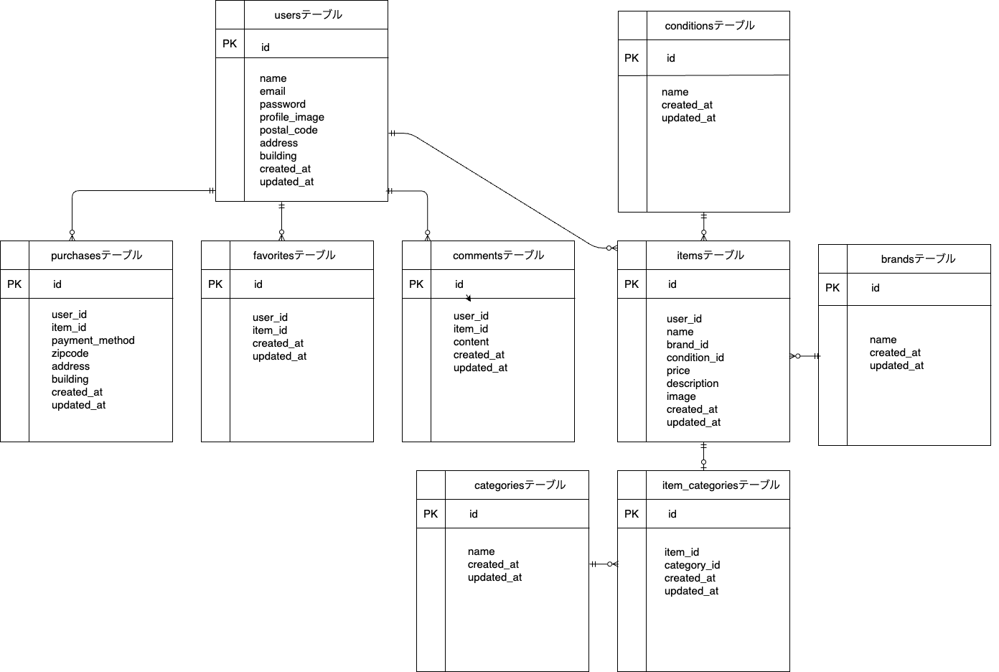

# フリマアプリ

## 環境構築  

### 画像取り扱いについて  

- 画像は `storage/app/public/images` に保存されています。  
- 画像をブラウザからアクセスするために、`php artisan migrate --seed`を実行後、`php artisan storage:link`コマンドを実行してください。 

### テストユーザー（ダミーユーザー）情報  
- 出品太郎  
- メールアドレス：seller@example.com  
- パスワード：password123  

- 出品次郎(ダミー商品出品者)  
- メールアドレス：seller2@example.com  
- パスワード：password456  

### Dockerビルド
1. git clone https://github.com/morikoshi2627/Flea-market.git  
2. cd Flea-market  
3. docker-compose build  
4. docker-compose up -d  
5. docker-compose exec php bash  

### Laravel環境構築
1. composer install  
2. cp .env.example .env  
3. php artisan key:generate  
4. .envのDB設定を以下のように修正  

   DB_CONNECTION=mysql  
   DB_HOST=mysql  
   DB_PORT=3306  
   DB_DATABASE=Flea-market_db  
   DB_USERNAME=Flea-market_user  
   DB_PASSWORD=Flea-market_pass  
5. php artisan migrate --seed  
 
### 開発環境
- 商品一覧画面（トップ画面）: http://localhost/  
- 会員登録画面： http://localhost/register/    
- phpMyAdmin: http://localhost:8080/  
  （ユーザー名: Flea-market_user、パスワード:Flea-market_pass）  

### 使用技術（実行環境）
- Laravel 8.83.29
- PHP 7.4.9-fpm
- MySQL 8.0.26
- Docker / Docker Compose

### ER図
  